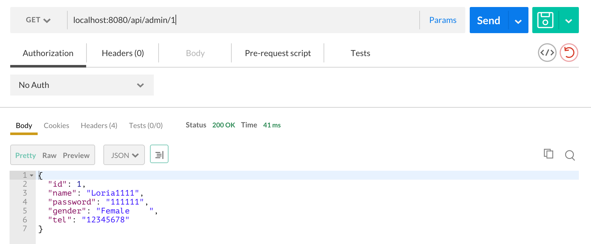

#运行

## 安装maven
如果没有安装maven, 可在此[下载安装](http://maven.apache.org/install.html)

## 安装MSSQL JDBC
1. 下载MSSQL JDBC, 从这里[下载](https://www.microsoft.com/en-us/download/details.aspx?displaylang=en&id=11774)
2. 在命令行运行以下命令(需已添加maven到PATH路径, 并切换当前文件夹到sqljdbc4.jar所在文件夹), 安装MSSQL JDBC到maven本地库

	`mvn install:install-file -Dfile=sqljdbc4.jar 
	-DgroupId=com.microsoft.sqlserver -DartifactId=sqljdbc4 
	-Dversion=4.0 -Dpackaging=jar`
3. 在BusAgent项目根文件夹(pom.xml文件所在文件夹)运行以下命令安装项目依赖

	`mvn package`
4. 然后运行以下命令运行程序, 自带的tomcat会启动应用在8080端口

	`java -jar target/bus-agent-0.0.1-SNAPSHOT.jar`
5. 当前程序可从数据库中获取Administrator相关信息, 并以json返回.

## 注意
本应用构建于Java Version1.8